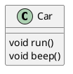
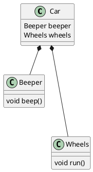

# 单一职责原则

## 定义
一个类只负责一件事情。分解类以降低耦合与修改成本。

## 举例
### 修改前
汽车会鸣笛，会前进。
### 修改后
汽车包含喇叭和车轮。汽车鸣笛调用喇叭鸣笛，汽车前进调用车轮前进。

## UML图
### 修改前

```puml
@startuml
'https://plantuml.com/class-diagram
class Car {
    void run()
    void beep()
}
@enduml
```
### 修改后

```puml
@startuml
'https://plantuml.com/class-diagram
class Car {
    Beeper beeper
    Wheels wheels
}
class Beeper {
    void beep()
}
class Wheels {
    void run()
}
Car *-- Beeper
Car *--- Wheels
@enduml
```