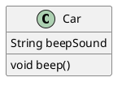
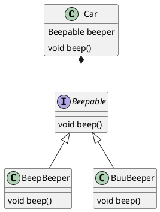

# 开闭原则
对扩展开放，对修改关闭

修改前

```puml
@startuml
class Car {
    String beepSound
    void beep() 
}
@enduml
```

如果要改变鸣笛的方式，只能修改car里面beep()的代码。如果我们把beep()行为抽象出来，编写实现类，那么以后有变化只要新增实现类并付给Car即可。

修改后

```puml
@startuml

class Car {
    Beepable beeper
    void beep() 
}

interface Beepable {
    void beep()
}

class BeepBeeper {
    void beep()
}

class BuuBeeper {
    void beep()
}

Beepable <|-- BeepBeeper
Beepable <|-- BuuBeeper
Car *-- Beepable

@enduml
```